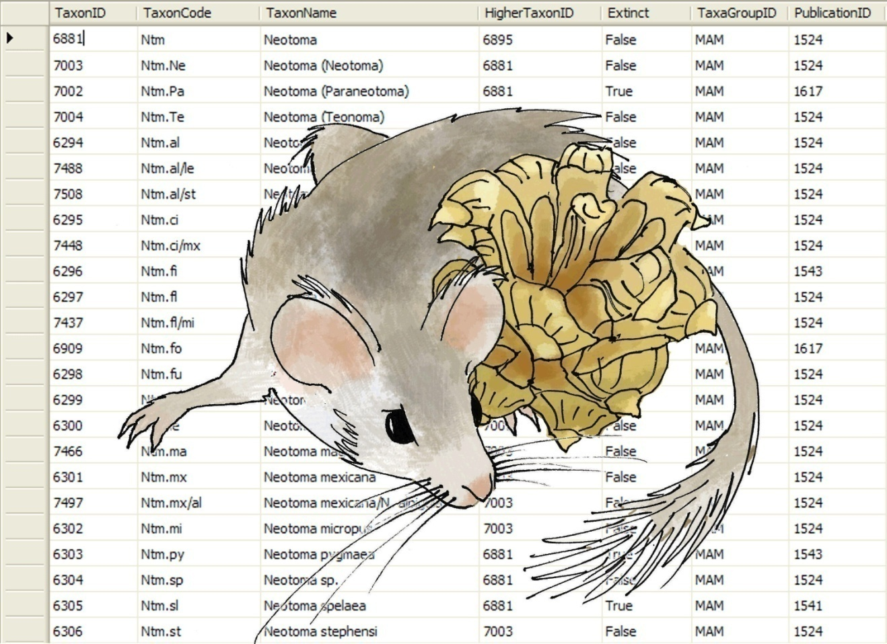

Neotoma Paleoecology Database
=================================

Acknowledgements
---------------------------------------------------------------------
This documentation would not be possible without the extrordinary work of Dr. Eric C. Grimm who has spent countless hours developing this manual.  In addition, Neotoma rests on the work of a number of researchers who contributed to the original North American Pollen Database, and subsequent data contributors, including FAUNMAP contributors.  The Neotoma Database would not exist were it not for the ongoing contributions of authors, data analysts and funding agencies, in particular the National Sciences Foundation.  This manual draws heavily from Eric Grimm's original Neotoma manual (v2), published as:

Grimm, E.C., 2008. Neotoma: an ecosystem database for the Pliocene, Pleistocene, and Holocene. *Illinois State Museum Scientific Papers E Series, 1*.

The SQL Server snapshot is accessible from here: http://www.neotomadb.org/snapshots

Full Manual Contents
======================

.. toctree::
   :maxdepth: -1

   neotoma_introduction
   db_design_concepts
   sql_quickly
   neotoma_tables
   tables_chron
   tables_dataset
   tables_samples
   tables_site
   tables_taxa
   tables_publications
   tables_contacts
   tables_publications
   references_cited

.. [1]
   Grant number 0622349

.. [2]
   Grant number 0622289

